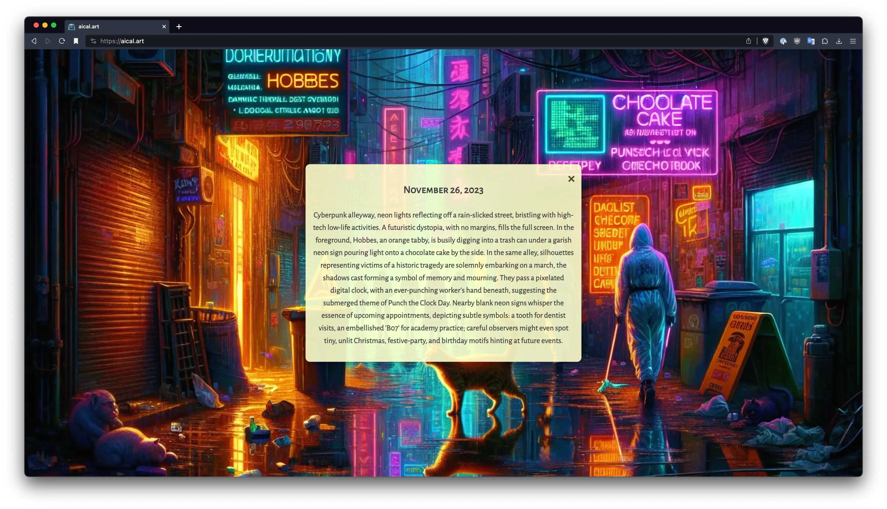
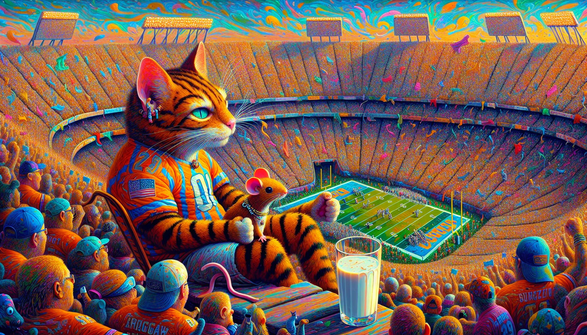
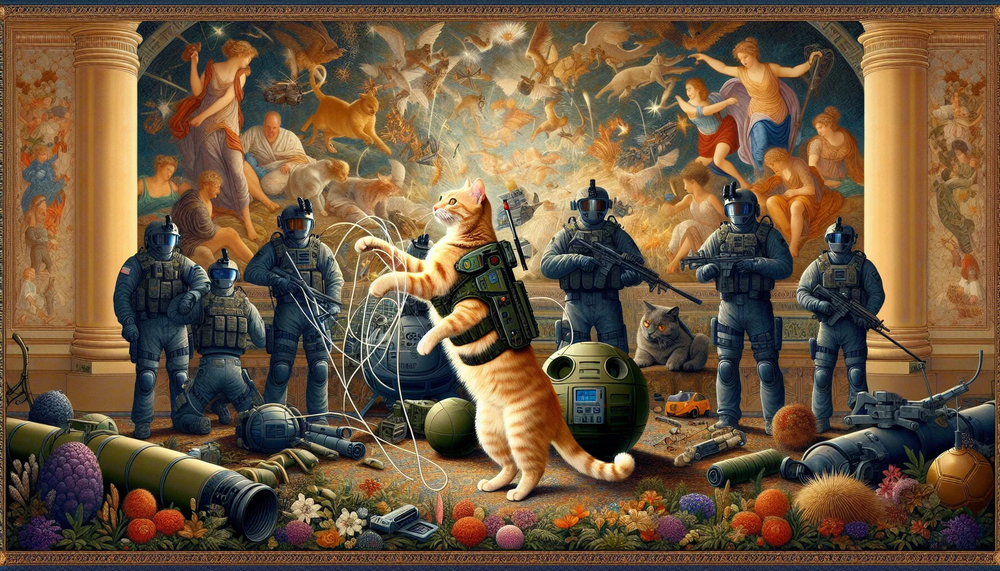
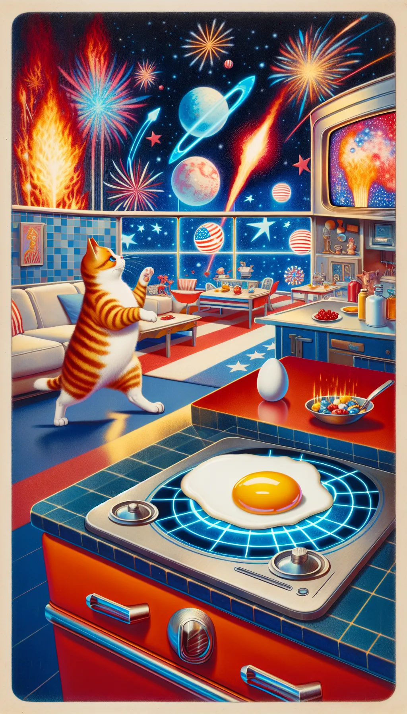
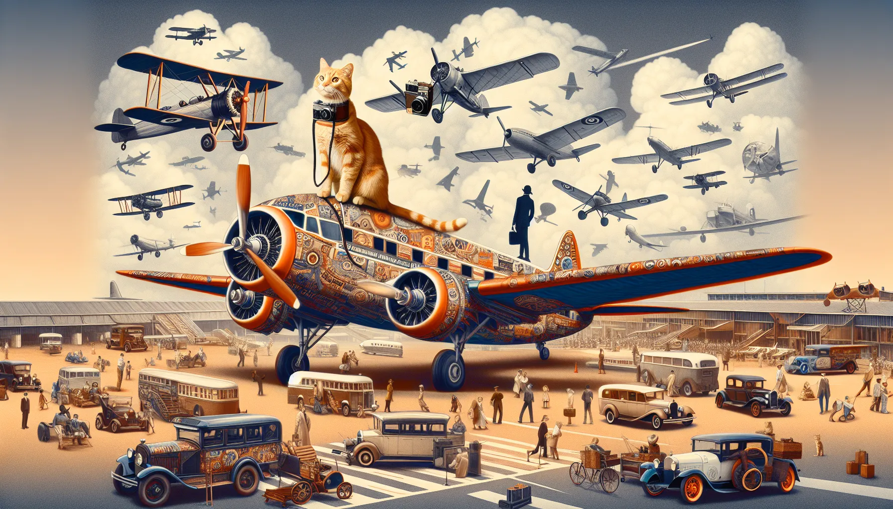

## AI Calendar Art

This repo hosts the scripts and template that powers [aical.art](https://aical.art). This project is heavily inspired by "Kuvastin - An E Ink art piece that displays daily AI art inspired by your calendar" ([Blog post here](https://turunen.dev/2023/11/20/Kuvastin-Unhinged-AI-eink-display/); [GitHub repo here](https://github.com/Iletee/kuvastin)).

<figure>
  
  <figcaption>
    <h4>Example image: Landscape oriented image shown with revised landscape prompt</h4>
    <p>On every successful script run, the following happens:</p>
    <ul>
      <li>Two images are created; one in a landscape orientation, one in a portrait orientation. On a mobile phone, you can see the other image when you flip your phone. On a desktop, you can shrink your screen size width-wise to see the portrait version.</li>
      <li>Three prompts are created: an original and its respective image orientation generated outputs. The original prompt is the one that is reciprocated from feeding Chat-GPT the initial prompt. The other respective orientation prompts are from revisions generated from DALL-E and are much closer aligned with what the final appearances seem to be.
</li>
    </ul>
    <p>Sources</p>
    <ul>
      <li>Breaking News Headlines</li>
      <li>Personal Google Calendars</li>
      <li>National Holidays</li>
      <li>Silly Days According To Some Website</li>
      <li>Custom Prompt Influencers (in this case, Hobbes, my cat)</li>
    </ul>
    <p>Mobile Phone Navigation</p>
    <ul>
      <li><strong>(double tap image)</strong> Toggle prompt display</li>
      <li><strong>(swipe) ← →</strong> Go back / forward in time</li>
    </ul>
    <p>Desktop / Laptop Navigation</p>
    <ul>
      <li><strong>?</strong> Toggle prompt display</li>
      <li><strong>(keys) ← →</strong> Go back / forward in time</li>
    </ul>
  </figcaption>
</figure>


### Prerequisites

Follow the directions for each respective link:

  * [Google API / OAuth token credentials](https://developers.google.com/calendar/api/quickstart/python)
  * [OpenaAI API key](https://platform.openai.com/docs/quickstart?context=python)
  * [An AWS S3 bucket](https://docs.aws.amazon.com/AmazonS3/latest/userguide/create-bucket-overview.html), `AWS_ACCESS_KEY_ID`, and `AWS_SECRET_ACCESS_KEY`<sup>1</sup>

    * <sup>1</sup> If you have access to the AWS CLI, you can use the following command to check the access key and secret access key set for a user:

      ```
      aws configure get aws_access_key_id
      aws configure get aws_secret_access_key
      ```

      Otherwise search AWS for `IAM` and access your user's information; this is where this information is kept.

### Setup

```
cd <to the root of where you want this project to live>
git clone git@github.com:ehamiter/aicalart.git
cp example.env .env  # And update this file with your API keys
python -m venv env
source env/bin/activate
pip install -r aical-reqs.txt  # Intentionally not named `requirements.txt` to save time on auto-build deployment systems
```

### Generation

```
python generate.py [--date --style --skip-news --skip-calendar --skip-holidays --skip-silly-days --skip-upload]
```

All parameters are optional-- `generate.py` run by itself will randomize elements and pull data from all available sources, then upload two images and three text prompts to AWS S3.

You can pass in a string value for `date` ("YYYY-MM-DD") or `style`.

```
python generate.py --date="2024-12-25"
python generate.py --style="Graffiti street art, bold spray paint, dynamic figures, urban expression"
python generate.py --date="2024-02-05" --style="1920s satirical black and white newspaper comics"
```


Skip fetching for news, calendar, holidays, and silly days:

```
python generate.py --date="2024-02-05" --skip-calendar
python generate.py --skip-news --skip-holidays
```

Skip uploading to S3, so the generated images will be created and saved in `staging/`, but not uploaded. Useful for experimentation:

```
python generate.py --skip-upload
```


### Examples

All of the examples below additionally have `--skip-upload` passed in, as explained above. Additionally, I have some items on my personal calendar that involve my youngest son attending soccer practices. They are titled things like "Practice: B07 Academy" so there are interesting interpretations of what that means exactly. These aren't echoed in the description printouts, but are still a part of the prompt that DALL-E receives, so there will be elements revolving around calendar events unless specifically skipped.

<details>
<summary><code>python generate.py --date="2024-02-11" --skip-upload</code></summary>
<figure>
  
  <figcaption>
    <h4>February 11, 2024: The Super Bowl, Don't Cry Over Spilled Milk Day, and Make A Friend Day</h4>
    <p><strong>Style:</strong> Neo-Expressionism, raw imagery, intense colors, emotional distortion</p>
    <p><strong>News:</strong> University of Pennsylvania president steps down amid criticism of antisemitism testimony - NBC News</p>
    <p><strong>Today:</strong> 2024-02-11, Super Bowl and Make a Friend Day and Don't Cry Over Spilled Milk Day</p>
    <p><strong>DALL-E prompt:</strong> Digital art, full screen, intense colors, Neo-Expressionism, emotional distortion, picturing a vibrant sports stadium filled with fans during the pinnacle of a championship game. Hobbes, the orange tabby, is seen amongst the crowd, wearing a miniature football jersey, sitting beside a new unlikely friend, a mouse with a tiny friendship bracelet. Behind them, an overturned milk glass, its contents ignored for the thrill of the game. All around, elements of celebration, teamwork, and camaraderie blend together in a dynamic expression of festive chaos, hinting at upcoming athletic practices and the joyous spirit of special personal celebrations without revealing specifics.</p>
    <p><strong>Landscape prompt:</strong> Full screen digital art embodying the Neo-Expressionism movement featuring emotional distortion and intense colors. The focal point is a bustling sports stadium filled to the brim with fans totally engrossed in the climax of a championship game. In the crowd, an identifiable orange-striped tabby character dressed in a tiny football jersey is found, sitting next to an unusual buddy, a mouse sporting a minuscule friendship bracelet. A further element behind them is a tipped over glass of milk, ignored in favor of the exciting sporting event. The atmosphere exhibits aspects of celebration, teamwork, and camaraderie in a vibrant display of joyful disorder, subtly indicating future athletic practices and the heartening ambiance of meaningful personal festivities without giving away detailed information. The image is crafted in a landscape format.</p>
  </figcaption>
</figure>
</details>

<details>
<summary><code>python generate.py --date="2024-05-04" --skip-calendar --skip-news --skip-upload</code></summary>
<figure>
  
  <figcaption>
    <h4>May 4th 2024: May The Fourth Be With You; Also EOD Day, I'm Surprised This Was Generated</h4>
    <p><strong>Style:</strong> Renaissance portrait, realistic details, chiaroscuro lighting, classical beauty</p>
    <p><strong>News:</strong> None</p>
    <p><strong>Today:</strong> 2024-05-04, National Explosive Ordnance Disposal (EOD) Day and Star Wars Day, Herb Day and Free Comic Book Day</p>
    <p><strong>DALL-E prompt:</strong> Digital art, award-winning art in 4k/8k resolution with realistic details and chiaroscuro lighting capturing classical beauty, no margins, full screen: Envision a tapestry that honors National Explosive Ordnance Disposal (EOD) Day through an allegorical scene where EOD technicians are depicted as Jedi from Star Wars, expertly disarming a variety of devices with lightsabers in hand. Amongst the high-tech gear and defused ordinance, intertwine herbs indigenous to the galaxy, symbolizing Herb Day. Woven into the backdrop are iconic comic book pages, representing Free Comic Book Day, each frame capturing a heroic moment of defusal. In the midst of this intricate ensemble, hide Hobbes the orange tabby cat playfully pawing at a deactivated thermal detonator, while donning a tiny EOD bomb suit, his whiskers twitching in the thrill of the disarmament, subtly blending into the narrative as both an observer and a silent hero.</p>
    <p><strong>Landscape prompt:</strong> Create a 4k/8k resolution digital art with meticulous details and chiaroscuro lighting highlighting classical beauty in full screen. Picture a tapestry commemorating National Explosive Ordnance Disposal (EOD) Day symbolically. The scene depicts EOD technicians of differing descents and genders, proficiently nullifying various devices, holding advanced tech tools in their hands. Enrich the backdrop with high-tech gear and neutralized ordnance. Intersperse species-specific flora from a faraway galaxy, giving a nod to Herb day. Embed the background with iconic scenes from an imaginary graphic novel, each frame displaying a gallant moment of disarming, this alludes to Free Comic Book Day. Central to this complex montage, incorporate a disguised generic orange tabby cat playfully batting a deactivated futuristic explosive device, adorning a miniature EOD explosive armor. The cat, merging smoothly into the narrative, serves as a silent observer and a subdued protagonist. This image should have a landscape orientation.</p>
  </figcaption>
</figure>
</details>


<details>
<summary><code>python generate.py --date="2024-07-04" --style="space age retro futurism, optimistic future visions, sleek designs, technological themes, cosmic exploration" --skip-upload</code></summary>
<figure>
  
  <figcaption>
    <h4>July 4th 2024: Sure, it's Independence Day; Did You Know It's Also Sidewalk Egg Frying Day?</h4>
    <p><strong>Style:</strong> space age retro futurism, optimistic future visions, sleek designs, technological themes, cosmic exploration</p>
    <p><strong>News:</strong> Penn President Liz Magill resigns days after antisemitism hearing - NPR</p>
    <p><strong>Today:</strong> 2024-07-04, Independence Day and Sidewalk Egg Frying Day</p>
    <p><strong>DALL-E prompt:</strong> "Space age retro futurism meets a patriotic celebration and whimsical summer shenanigans as Hobbes, the cunning orange tabby, tiptoes across a sleek, high-tech kitchen where an egg fries on the sidewalk-themed countertop, amidst a display of red, white, and blue cosmic explorations, with hidden symbols of familial affection and festive cheer, encapsulated in a full screen, no-margins tableau of optimistic future visions."</p>
    <p><strong>Portrait prompt:</strong> Envision a scene rendered in retro futurism, blended with a whimsical summer vibe and patriotic symbols. Picture a clever orange-striped cat, reminiscent of a carefree, playful character, steadily walking across a shiny, innovative kitchen that features a countertop designed to mimic a heated sidewalk where an egg is frying. The whole surrounding bursts with hues of red, white, and blue - a celebration of cosmic exploration. Concealed within this tableau are symbols expressing familial love and holiday cheer, all enclosed within a full screen, margin-free composition that displays a hopeful vision of the future- captured in a vertical orientation.</p>
  </figcaption>
</figure>
</details>

<details>
<summary><code>python generate.py --date="2024-08-19" --skip-calendar --skip-upload</code></summary>
<figure>
  
  <figcaption>
    <h4>August 19th 2024: Aviation, Photos, And Giant Cats Perched On Top Of Planes</h4>
    <p><strong>Style:</strong> Transavantgarde, return to figurative painting, eclectic styles, emotive expression</p>
    <p><strong>News:</strong> Penn President Liz Magill resigns after facing intense controversy; chair of school's board of trustees also steps down - The Philadelphia Inquirer</p>
    <p><strong>Today:</strong> 2024-08-19, National Aviation Day and World Photo Day</p>
    <p><strong>DALL-E prompt:</strong> Digital art, award-winning art in 4k/8k resolution, showcasing a Transavantgarde style with a return to figurative painting and eclectic styles paired with emotive expression, no margins, and full-screen composition: Create an image that celebrates National Aviation Day by featuring a bustling international airport scene where vintage and modern aircraft are adorned with motifs that pay tribute to the evolution of photography in honor of World Photo Day. Incorporated into this dynamic tableau is Hobbes, the orange tabby cat, perched nonchalantly on top of a classic propeller plane, with a camera strap casually draped around his neck, symbolizing the observer's role in both aviation and photography. In the cloud formations above, discernible upon close inspection, is the subtle silhouette of famous aviators and photographers, hinting at their impact on their respective fields, while the overall scene encapsulates the joyous spirit of human achievement in flight and art.</p>
    <p><strong>Landscape prompt:</strong> Create an image in Transavantgarde style showcasing a bustling international airport scene in celebration of National Aviation Day. The scene incorporates vintage and modern aircraft adorned with motifs paying homage to the evolution of photography, in honor of World Photo Day. Position an orange tabby cat perched nonchalantly on top of a classic propeller airplane, with a camera strap around his neck, symbolizing the observer's role in aviation and photography. In the cloud formations, subtly incorporate silhouettes of notable contributors to aviation and photography. This busy scene denotes the joyful spirit of human achievement in the realms of flight and art. Maintain a high-quality resolution and horizontal orientation.</p>
  </figcaption>
</figure>
</details>


### Why Is There A Cat In Every Image?

That's Hobbes, [and he instructed me to do so](https://github.com/ehamiter/aicalart/blob/main/example.env#L10).


### File Structure

Each successful run will generate two images and three prompts and save them in the .gitignored `staging/` directory. They are stored as `webp` files, [which are significantly smaller in size](https://developers.google.com/speed/webp) compared to `png` files. The only browser that doesn't support it is Internet Explorer, so `webp` it is.

The file structure looks like this:

```
landscape-<YYYY-MM-DDTHH:M:SS:MS>Z.webp
portrait-<YYYY-MM-DDTHH:M:SS:MS>Z.webp

landscape-<YYYY-MM-DDTHH:M:SS:MS>Z.txt
portrait-<YYYY-MM-DDTHH:M:SS:MS>Z.txt
original-<YYYY-MM-DDTHH:M:SS:MS>Z.txt
```

**This will also cost you ~$0.16 for every run.** [Keep an eye on your usage](https://platform.openai.com/usage), and set notifications and credit limits. It adds up quick.

### A Word On Generation Failures
Sometimes it happens to be a bad news day, or questionable events might be happening on your personal calendar. No judgment here. However, DALL-E might balk at a particularly grievous description that would violate its content policies. Try to re-word the initial prompt, or skip the news or calendar if that's the culprit. There's an automatic gradual removal of potentially negatively-influential prompts (e.g., war atrocities in the news, a particularly questionable personal event in your calendar, etc.) until it's just a prompt to make a day about a cat. If that fails, then it bails.


### Manual Promotion
If you skip the upload, you can still upload manually. Clicking either of the image filenames on a Mac in Finder will conveniently select the entirety of the name up until the extension, but the colons are represented in slashes. Example:

```
portrait-2023-12-03T05/04/58.791456Z
```

So you can plug it in like so:
```
python promote.py portrait-2023-12-03T05/04/58.791456Z
```
(At the conclusion of a prompt generation, this line is printed out at the end by itself, so if you use iTerm and have "Copy to pasteboard on selection" enabled, you can double-click the line and it auto-selects and copies it for ease of pasting into the command line. Boy howdy!)

After entering this line, it will upload the images and prompts to S3, and the site will reflect the new sources immediately. Whatever YYYY-MM-DD format is in that string will be applied for that day for both images and all three prompts.


### AWS S3

#### Granting public viewing permissions:
```json
{
    "Version": "2012-10-17",
    "Statement": [
        {
            "Sid": "PublicReadGetObject",
            "Effect": "Allow",
            "Principal": "*",
            "Action": "s3:GetObject",
            "Resource": "arn:aws:s3:::aicalart/*"
        }
    ]
}
```

#### CORS settings so fetching the prompts will work:
```json
[
    {
        "AllowedHeaders": ["*"],
        "AllowedMethods": ["GET"],
        "AllowedOrigins": ["https://aical.art"],
        "ExposeHeaders": [],
        "MaxAgeSeconds": 3000
    }
]
```

To make every object publicly available, you can edit the access control list (ACL) and check "List" and "Read" for "Everyone (public access)".

### webp image orientation paths
```
# Current images
https://aicalart.s3.amazonaws.com/images/landscape.webp
https://aicalart.s3.amazonaws.com/images/portrait.webp

# Archived images
https://aicalart.s3.amazonaws.com/images/YYYY-MM-DD-landscape.webp
https://aicalart.s3.amazonaws.com/images/YYYY-MM-DD-portrait.webp
```

### original prompt from Chat GPT; finalized orientation prompts from DALL-E
```
# Current prompts
https://aicalart.s3.amazonaws.com/prompts/original.txt
https://aicalart.s3.amazonaws.com/prompts/landscape.txt
https://aicalart.s3.amazonaws.com/prompts/portrait.txt

# Archived prompts
https://aicalart.s3.amazonaws.com/prompts/YYYY-MM-DD-original.txt
https://aicalart.s3.amazonaws.com/prompts/YYYY-MM-DD-landscape.txt
https://aicalart.s3.amazonaws.com/prompts/YYYY-MM-DD-portrait.txt
```

### Cron

I have this set up on an Ubuntu home server with a cron schedule of:

```
00 00 * * * cd /home/eric/projects/aicalart && ./env/bin/python3 ./generate.py >> ../logs/aicalart.log 2>&1
```

So if there's an error I can ssh into the machine and read the error log file it generated. Otherwise it should be ready to generate a pair of images and submit them to S3 at midnight CST every day. Since this updates the image asset that the website is already pointing to, this pseudo-deployment during promotion is near-instantaneous.


### Stability / Pull Requests

This is a highly experimental, subject-to-change-at-any-moment project that could explode in a glorious fireball for any or no reason. I probably won't accept pull requests unless they are coincidentally specific to my needs at the time. No hard feelings.
